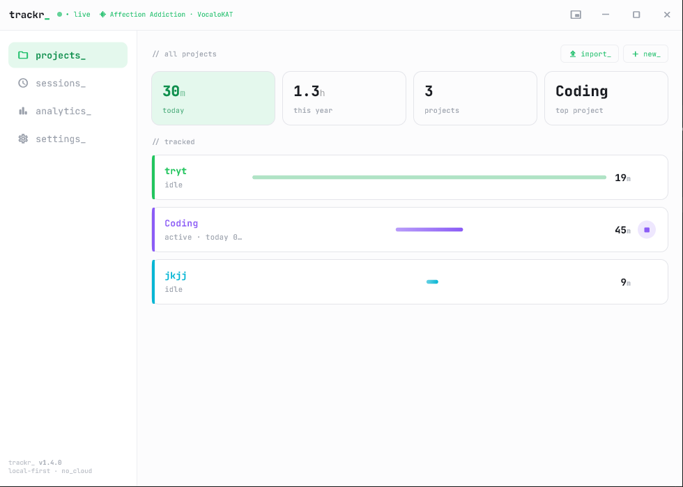
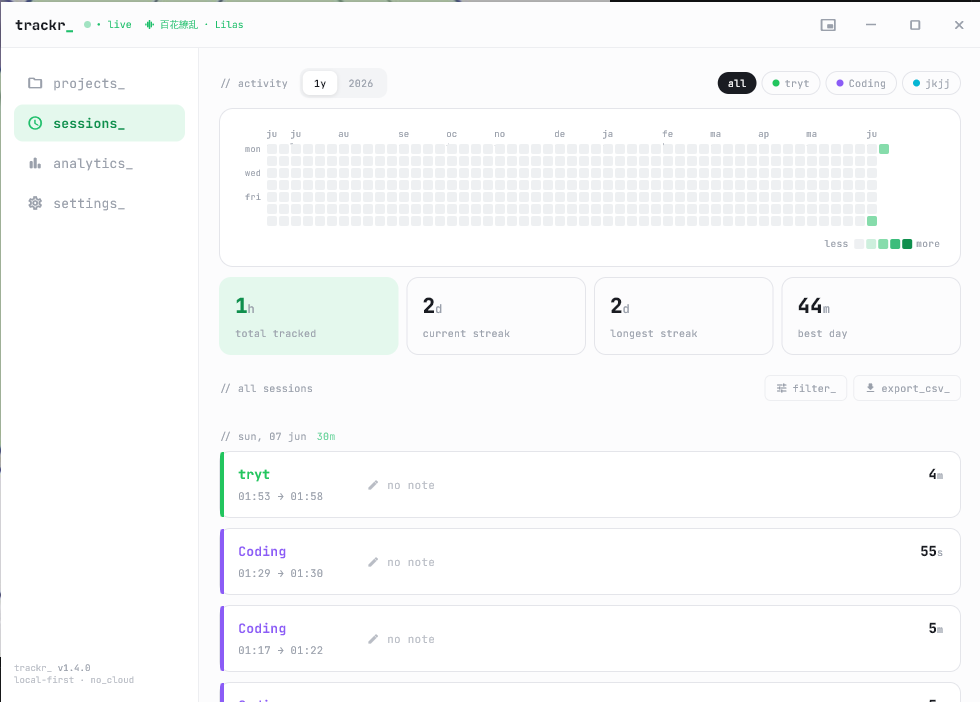
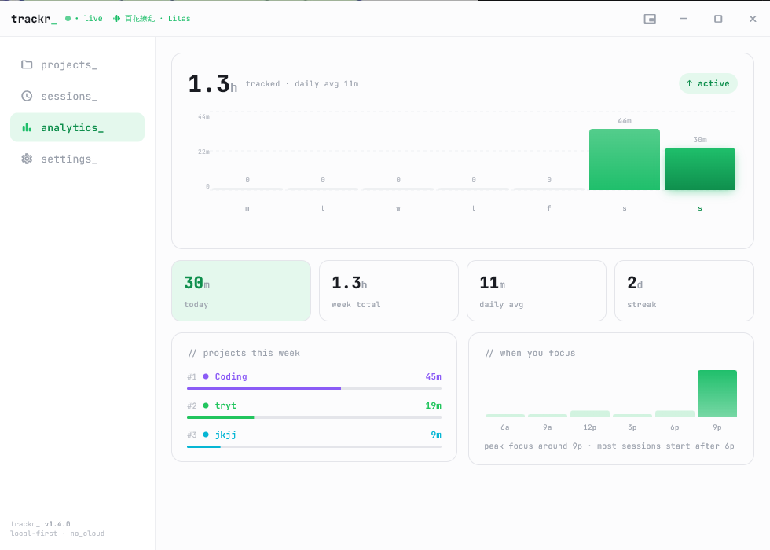
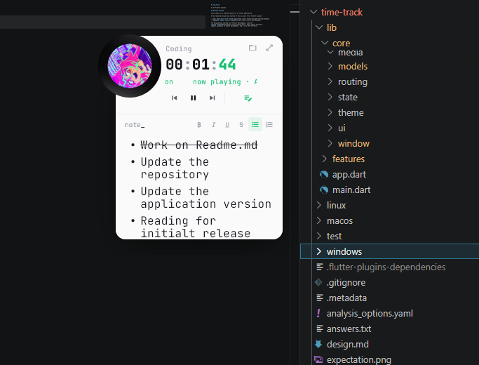

<div align="center">


# trackr_

Intentional time tracking with session notes and music context.

[](https://flutter.dev)
[](https://dart.dev)
[]()
[]()

</div>

---

## Screenshots

<div align="center">

| Dashboard | Timer Session |
|---|---|
|  |  |

| Analytics | Mini Mode |
|---|---|
|  |  |

</div>

---

## Features

- **Timer** — start/stop sessions with per-project tracking and inline notes
- **Projects** — organize sessions by project; view active session header and stats
- **Sessions** — browse past sessions, view/edit notes, heatmap activity view
- **Analytics** — time breakdowns across projects and date ranges
- **Mini mode** — compact floating window (top-right) with SMTC music context and project picker
- **Music context** — Windows SMTC integration captures currently playing track per session
- **Notes** — rich text (Quill) notes attached to each session
- **Settings** — inactivity timeout, mini-mode behavior, theme

### Platform

| Platform | Status |
|---|---|
| Windows (x64) | ✅ |
| macOS | Not configured |
| Linux | Not configured |

---

## Prerequisites

| Tool | Version | Notes |
|---|---|---|
| Flutter SDK | 3.35+ | `flutter --version` to check |
| Dart SDK | 3.9+ | Included with Flutter |
| Git | any | — |
| Python 3 | 3.10+ | For release builds only |
| Inno Setup 6 | 6.x | Windows installer only — [download](https://jrsoftware.org/isdl.php) |

---

## Getting Started

### 1. Install dependencies

```bash
flutter pub get
```

### 2. Run the app

```bash
# Windows
flutter run -d windows
```

> **Note:** All data is stored locally via Hive. No backend or cloud account required.

---

## Building for Release

```bash
# Build Windows installer
python installers/build_release.py

# Windows only
python installers/build_release.py windows
```

### Output

- Raw build: `build/windows/x64/runner/Release/`
- Installer (`.exe`): `installers/trackr-v<version>.exe`

Requires [Inno Setup 6](https://jrsoftware.org/isdl.php) at `C:\Program Files (x86)\Inno Setup 6\ISCC.exe`.

### Manual build

```bash
flutter build windows --release
```

---

## Project Structure

```
lib/
├── core/
│   ├── cache/          # Hive local cache wrappers
│   ├── di/             # Custom service locator
│   ├── error/          # Failure types
│   ├── hotkey/         # Global hotkey service
│   ├── media/          # Windows SMTC media info
│   ├── models/         # Shared models (Session, Project, MusicEntry, AppSettings)
│   ├── routing/        # Named routes
│   ├── state/          # StreamState + StreamStateBuilder
│   ├── theme/          # AppStyling — colors, text styles
│   ├── ui/             # Shared widgets (ScopeScreen, desktop title bar)
│   └── window/         # Window sizing and mode service
└── features/
    ├── analytics/      # Time breakdowns and charts
    ├── projects/       # Project management
    ├── sessions/       # Session history and heatmap
    ├── settings/       # App settings
    └── timer/          # Active timer, notes, mini mode
```

Each feature follows the same folder contract:

```
features/<feature>/
├── presentation/
│   ├── screen/     # ScopeScreen entry points
│   ├── widget/     # Reusable, domain-logic-free components
│   ├── state/      # StreamState subclasses
│   ├── sheets/     # Bottom sheets
│   └── dialogs/    # Dialog components
├── domain/
│   ├── controller/ # Orchestrates use cases
│   └── repository/ # Abstract interfaces
└── data/
    ├── repository/ # Concrete implementations
    └── datasource/ # Local (Hive) data sources
```

---

## Architecture Notes

- **State management:** `StreamState` + `StreamStateBuilder` only.
- **DI:** Custom service locator in `core/di/`. No GetIt, BLoC, or Riverpod.
- **Storage:** Hive — fully offline, no backend.
- **Music:** Windows SMTC via native plugin (`windows/runner/smtc_plugin.cpp`) — auto-captures track info when a session is active.
- **Mini mode:** Frameless compact window, always-on-top, positioned top-right. Hotkey toggles between full and mini.
